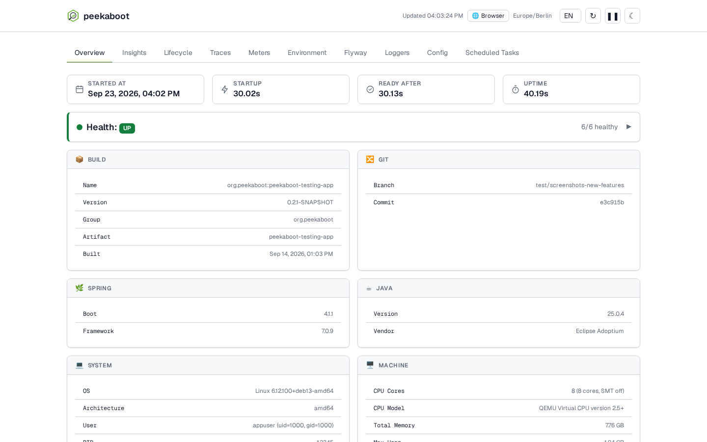

<p align="center">
  <picture>
    <source media="(prefers-color-scheme: dark)" srcset="peekaboot-frontend/src/main/resources/META-INF/peekaboot/ui/assets/logo-mark-dark.png">
    
  </picture>
</p>

# Peekaboot

Embedded application introspection for Spring Boot — health, config, migrations, logs,
schedules, metrics and traces in one dashboard, with no external infrastructure.

## Quick start

**Maven**

```xml
<dependency>
    <groupId>org.peekaboot</groupId>
    <artifactId>peekaboot-spring-boot-starter</artifactId>
    <version>0.0.5-SNAPSHOT</version>
</dependency>
```

**Gradle**

```groovy
implementation("org.peekaboot:peekaboot-spring-boot-starter:0.0.5-SNAPSHOT")
```

Run your app the way you already do. Peekaboot detects local development and turns itself
on — open the dashboard at `http://localhost:8080/peekaboot/`. Local development means an
IDE run, `mvn spring-boot:run` or `gradle bootRun` on your own machine; a packaged jar, a
container, a test, an AOT build or a native image counts as not local. Set
`peekaboot.enabled=true|false` (and `peekaboot.dev-toolbar` for the toolbar alone) to
override the detection in either direction.



## What you get

- A dev toolbar, on by default in local development, docked to every page: request status,
  duration, query count, and a click-through to the full trace — plus correlated logs and
  request/response detail (headers and params, not bodies), neither of which is captured
  without it
- App-insights dashboard: health, environment, config, Flyway, loggers and scheduled tasks,
  read from Actuator in-process, plus metrics read directly from Micrometer's
  `MeterRegistry` — nothing exposed under `/actuator/**`
- In-memory request tracing via Micrometer/OpenTelemetry, no collector to run
- Restart-aware insights: charts mark every application start and stop, annotated with
  what changed about the build, and the metric history itself survives a restart
- Zero configuration: on automatically in local development, off everywhere else

## Documentation

Full docs — configuration reference, security guidance, the dashboard tour, and more — live
at **[peekaboot.org](https://peekaboot.org)**.

| Page | |
| --- | --- |
| [Quick start](https://peekaboot.org/docs/quick-start/) | One dependency, no configuration, the toolbar on your next run |
| [Configuration](https://peekaboot.org/docs/configuration/) | Every `peekaboot.*` property, grouped by prefix, with its default |
| [Security](https://peekaboot.org/docs/security/) | What Peekaboot exposes when it's on, and how to lock it down |
| [The dashboard](https://peekaboot.org/docs/dashboard/) | A tour of every tab |

## Working on Peekaboot

```
peekaboot/
├── peekaboot-backend/                    # Core logic and APIs
├── peekaboot-test-support/               # Shared test helpers (never published)
├── peekaboot-frontend/                   # Static web resources
├── peekaboot-spring-boot-autoconfigure/  # Auto-configuration
├── peekaboot-spring-boot-starter/        # Dependency aggregator
├── peekaboot-testing-app/                # Sample app + UI tests
└── peekaboot-coverage/                   # JaCoCo aggregate report + coverage floor
```

```bash
mvn clean install   # full build, all modules
mvn test             # unit tests only (~1 min); integration tests need `mvn verify`

cd peekaboot-testing-app && mvn spring-boot:run   # run the sample app; needs a prior
                                                  # `mvn install` and a running Docker
```

`mvn verify` also enforces six gates: Spotless (palantir-java-format, ratcheted to files
changed since its introduction - run `mvn spotless:apply` to format), Error Prone (during
compilation), SpotBugs, Checkstyle (complexity metrics from `config/checkstyle.xml`), PMD
(quickstart rules from `config/pmd-ruleset.xml`), and the reactor-wide JaCoCo coverage
floor in `peekaboot-coverage`.

See [`BUILD.md`](BUILD.md) for the full build: reactor layout, compiler and gate
configuration, CI and the release pipeline.

See [`docs/ARCHITECTURE.md`](docs/ARCHITECTURE.md) for the module/event/data flow,
[`docs/TESTING.md`](docs/TESTING.md) for testing conventions,
[`docs/GLOSSARY.md`](docs/GLOSSARY.md) for domain terms,
[`peekaboot-frontend/README.md`](peekaboot-frontend/README.md) for the frontend's design
system, and [`peekaboot-testing-app/README.md`](peekaboot-testing-app/README.md) for the
sample app's demo scenarios and the screenshot-capture command.

## Requirements

- Java 25+ — the baseline is the current LTS on purpose: the build compiles with
  `release 25` and has no toolchain fallback, Peekaboot's collectors run on virtual
  threads, and nothing below 25 is built or tested
- Spring Boot 4.1 (built and tested against)

## License

Apache License 2.0
